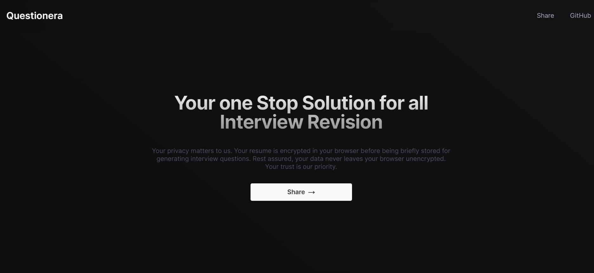
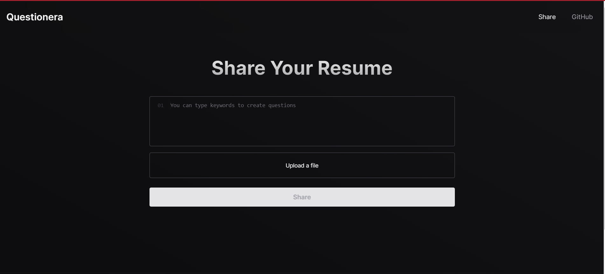

# Questionera - Resume-Based Interview Question Generator

Questionera is a dynamic web application developed using Next.js, Py2PDF, and the OpenAI API, designed to streamline interview preparation by generating two types of questions from a resume: behavioral and technical. Leveraging keyword extraction from the resume, Questionera automates the process of generating relevant interview questions tailored to the candidate's skills and experience.

## Features

### Resume-Based Question Generation
- Utilizes Py2PDF to extract keywords from resumes.
- Generates two types of questions: behavioral and technical.
- Questions are customized based on the keywords extracted from the resume.

### Modern Interface
- Clean and intuitive user interface built with Next.js.
- Responsive design ensures optimal viewing experience across devices.

### Real-Time Updates
- Dynamic question generation provides instant feedback as resumes are uploaded.

## How to Use

1. Clone the repository to your local machine.
2. Install dependencies using `npm install`.
3. Start the development server with `npm run dev`.
4. Navigate to the Questionera website in your preferred web browser.
5. Upload a resume to generate interview questions.
6. Review the generated questions categorized as behavioral and technical.

## Screenshots

## Usage

Questionera can be seamlessly integrated into various recruitment platforms or used as a standalone tool for interview preparation. Developers can incorporate the provided API endpoints into their applications to offer resume-based interview question generation functionality.

## Contributions

Contributions to Questionera are highly encouraged! If you have any suggestions, feature requests, or bug fixes, please submit a pull request following the contribution guidelines outlined in the repository.

## Contact

For inquiries, feedback, or support, please contact the project maintainer at [heetvadiya@gmail.com].

## License

Questionera is released under the MIT License, granting users the freedom to utilize, modify, and distribute the application for personal or commercial purposes.

Experience the convenience and efficiency of resume-based interview question generation with Questionera. Simplify your interview preparation process today!
